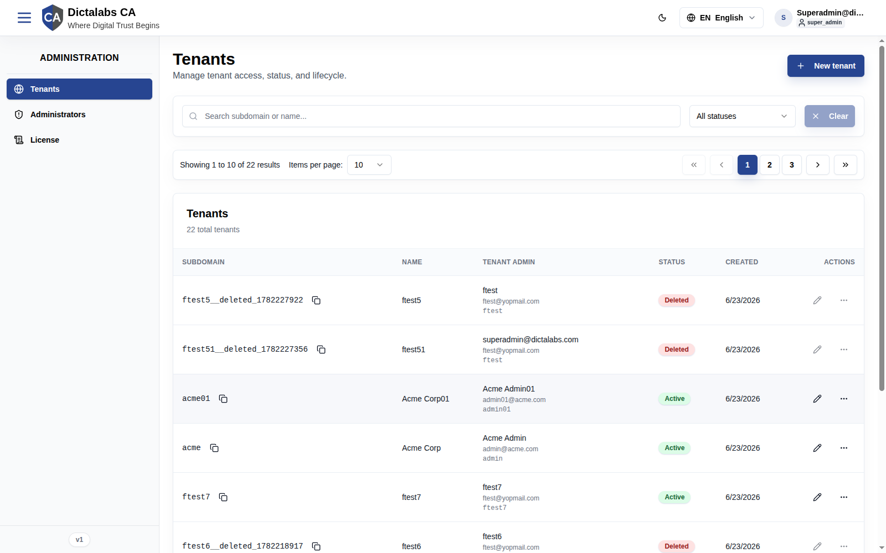
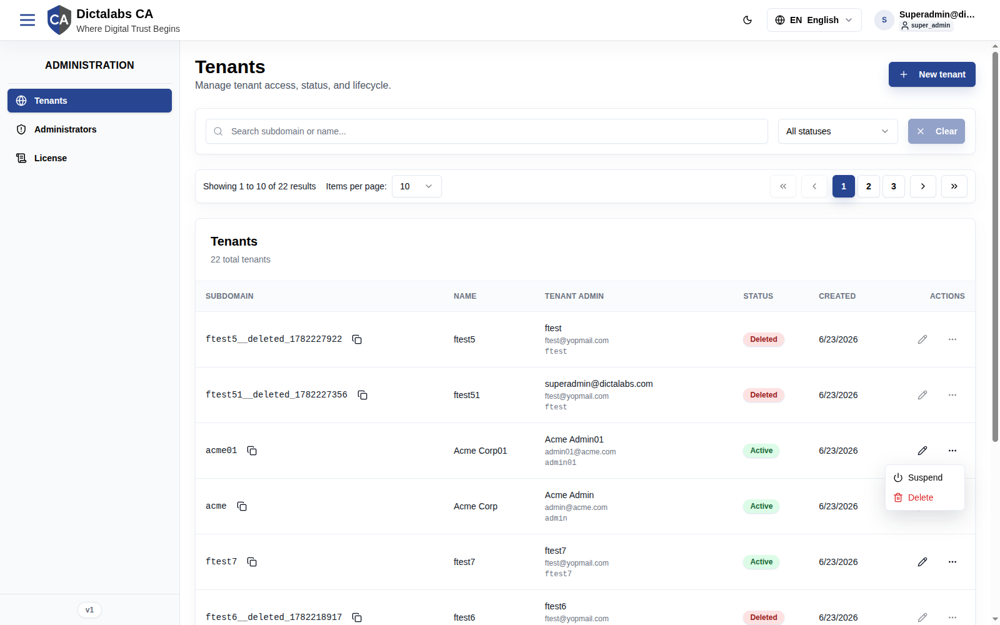
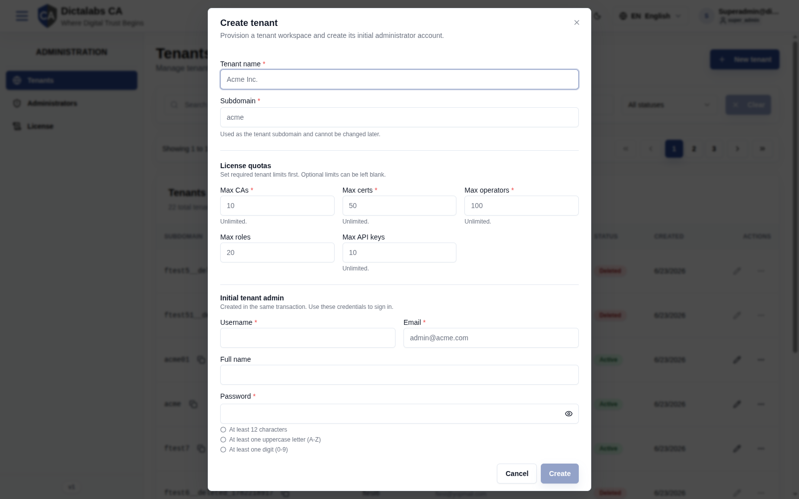
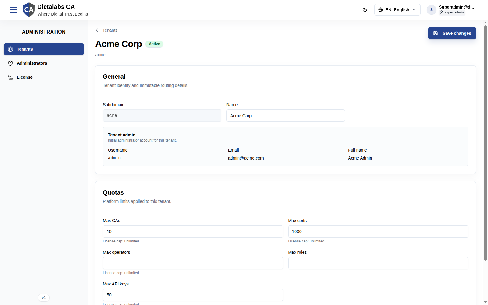

# Tenant Management

## Purpose

Tenants are isolated customer workspaces. This module lets a System Administrator create
tenants, set their resource quotas, manage their lifecycle (active / suspended / deleted),
and open a tenant's detail page to adjust its limits. It solves the problem of running one CA
service for many organizations without letting their data or configuration mix.

**Who should use it:** Super Admins responsible for onboarding and governing tenants.

## Navigation

`Administration → Tenants` (`/platform/tenants`)

## Overview

The Tenants page has:

- **Header** with page title and a **New tenant** button.
- **Filter bar** — search by subdomain or name, a **status** filter (All statuses / Active /
  Suspended / Deleted), and a **Clear** button.
- **Pagination controls** — "Showing X to Y of N results", items-per-page selector (default 10),
  and page navigation.
- **Tenants table** — columns: **Subdomain**, **Name**, **Tenant admin** (name / email / username),
  **Status**, **Created**, **Actions**.

Each row's **Subdomain** cell has a **Copy tenant URL** button. The **Actions** column has an
**Edit** link (opens the tenant detail page) and an **Actions** menu. For **Deleted** tenants,
editing and the actions menu are disabled (label: *"Editing is unavailable for deleted tenants"*).

### Row Actions menu

For an active tenant the actions menu offers **Suspend** and **Delete**. A suspended tenant
offers **Reactivate** instead of Suspend.

## Fields — Create Tenant dialog

Opened with **New tenant**. *"Provision a tenant workspace and create its initial administrator account."*

| Field | Description | Required | Notes |
| ----- | ----------- | -------- | ----- |
| Tenant name | Human-readable name (e.g. *Acme Inc.*) | Yes | — |
| Subdomain | Tenant subdomain / slug (e.g. `acme`) | Yes | **Cannot be changed later.** Lowercase letters, digits, hyphens; reserved names blocked. |
| Max CAs | License quota: max certificate authorities | Yes | Blank = Unlimited. |
| Max certs | License quota: max certificates | Yes | Blank = Unlimited. |
| Max operators | License quota: max operator accounts | Yes | Blank = Unlimited. |
| Max roles | License quota: max roles | No | Optional limit. |
| Max API keys | License quota: max API keys | Yes | Blank = Unlimited. |
| Username | Initial tenant admin username | Yes | Created in the same transaction. |
| Email | Initial tenant admin email | Yes | — |
| Full name | Initial tenant admin full name | No | — |
| Password | Initial tenant admin password | Yes | Must satisfy: ≥12 chars, ≥1 uppercase, ≥1 digit, ≥1 special character. |
| Confirm password | Re-enter password | Yes | Must match Password. |

The **Create** button stays disabled until all required fields are valid.

## Fields — Tenant Detail page

Open via a row's **Edit** link (`/platform/tenants/<id>`). Sections:

**General**

| Field | Description | Required | Notes |
| ----- | ----------- | -------- | ----- |
| Subdomain | Tenant routing slug | — | Read-only (immutable). |
| Name | Display name | Yes | Editable. |
| Tenant admin (Username / Email / Full name) | The seeded admin account | — | Read-only summary. |

**Quotas** (license cap shown beneath each)

| Field | Description | Required | Notes |
| ----- | ----------- | -------- | ----- |
| Max CAs | Max certificate authorities | No | Shows "License cap: …". |
| Max certs | Max certificates | No | — |
| Max operators | Max operator accounts | No | — |
| Max roles | Max roles | No | — |
| Max API keys | Max API keys | No | — |
| Request rate limit | Max requests per minute for this tenant | No | Blank = system default. |

## Actions

- **New tenant** — open the Create Tenant dialog.
- **Copy tenant URL** — copy the tenant's login URL to the clipboard.
- **Edit** — open the tenant detail page.
- **Save changes** (detail page) — persist name / quota / rate-limit edits.
- **Suspend** — block tenant access (status → Suspended); reversible.
- **Reactivate** — restore a suspended tenant to Active.
- **Delete** — archive the tenant (soft delete); subdomain becomes reusable, data retained.

## Step-by-Step — Create a tenant

1. Open **Administration → Tenants**.
2. Click **New tenant**.
3. Enter **Tenant name** and **Subdomain** (the subdomain is permanent).
4. Set the required **License quotas** (leave optional ones blank for Unlimited).
5. Fill the **Initial tenant admin** Username, Email, (Full name), and a compliant **Password** + confirmation.
6. Click **Create**.

## Step-by-Step — Suspend / Reactivate / Delete

1. On the Tenants list, find the tenant row.
2. Open the **Actions** menu.
3. Choose **Suspend**, **Reactivate**, or **Delete** and confirm.

## Expected Result

- **Create:** the tenant's schema is provisioned, the admin role/permissions are seeded, and the
  initial admin is created; the tenant appears as **Active** and is reachable at its subdomain.
- **Suspend:** tenant users can no longer sign in until reactivated.
- **Delete:** the tenant is marked **Deleted**, its subdomain is freed for reuse, and its row's
  edit/actions controls are disabled.

> Note: this guide documents the read-only/open state of each dialog. Post-submit confirmation
> screens were not captured because the audit did not create live records.

## Notes

- **Best practice:** choose subdomains carefully — they are immutable. Plan a naming convention.
- **Warning:** Delete is a tenant-wide action. Use Suspend for temporary lockouts.
- **Common mistake:** leaving a required quota blank expecting a default — blank means *Unlimited*.
- Quotas are enforced at runtime; a tenant hitting its CA/cert/API-key cap will be blocked from
  creating more until the limit is raised on the detail page.
