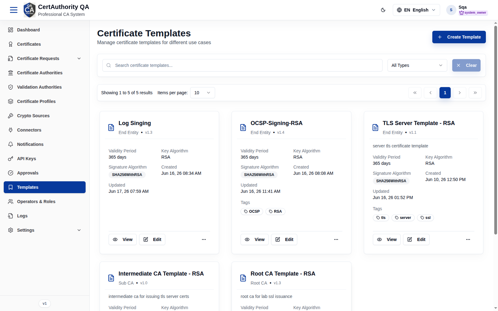
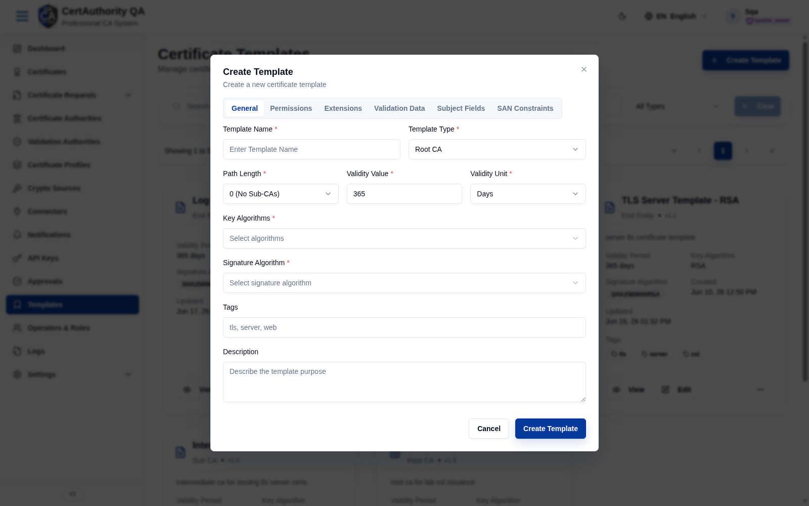
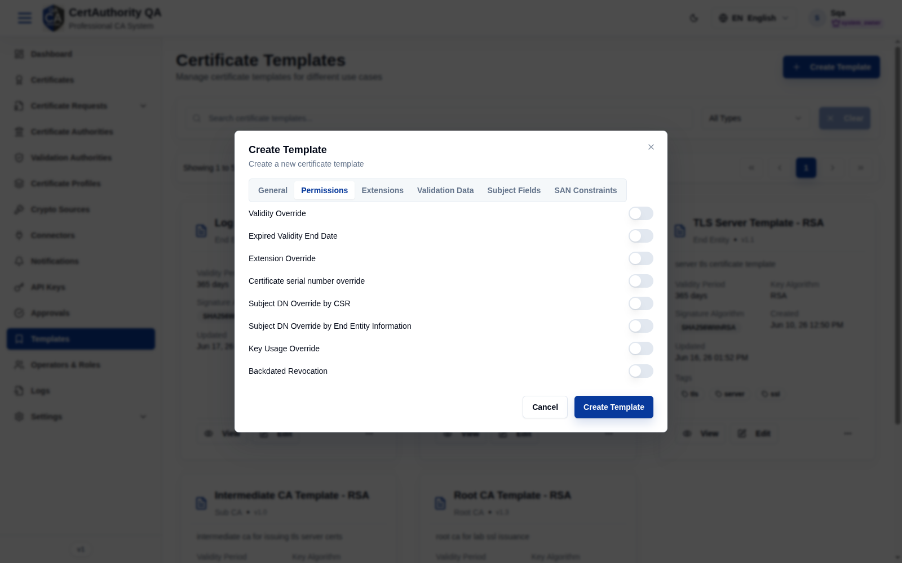
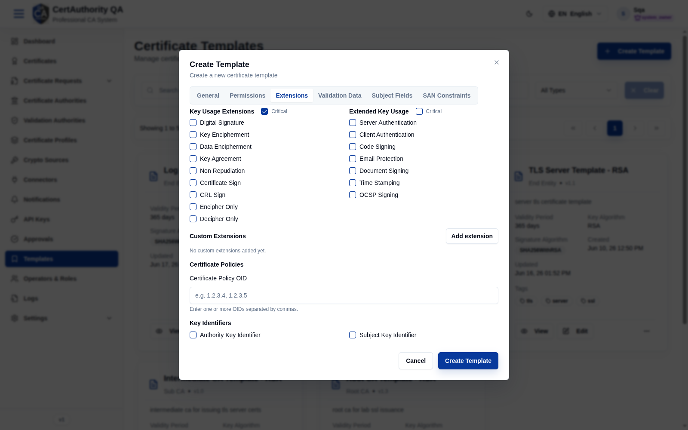
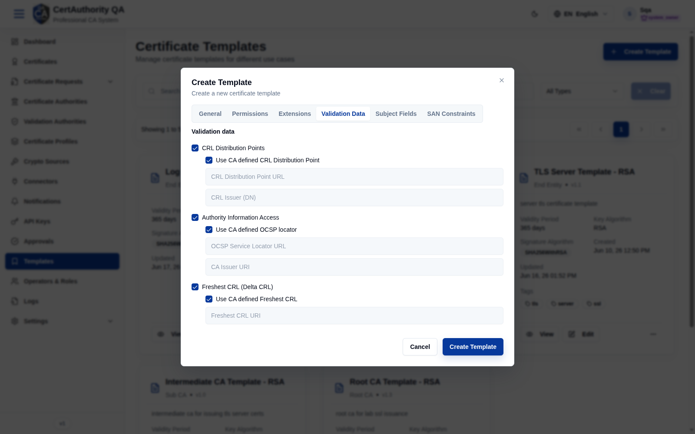
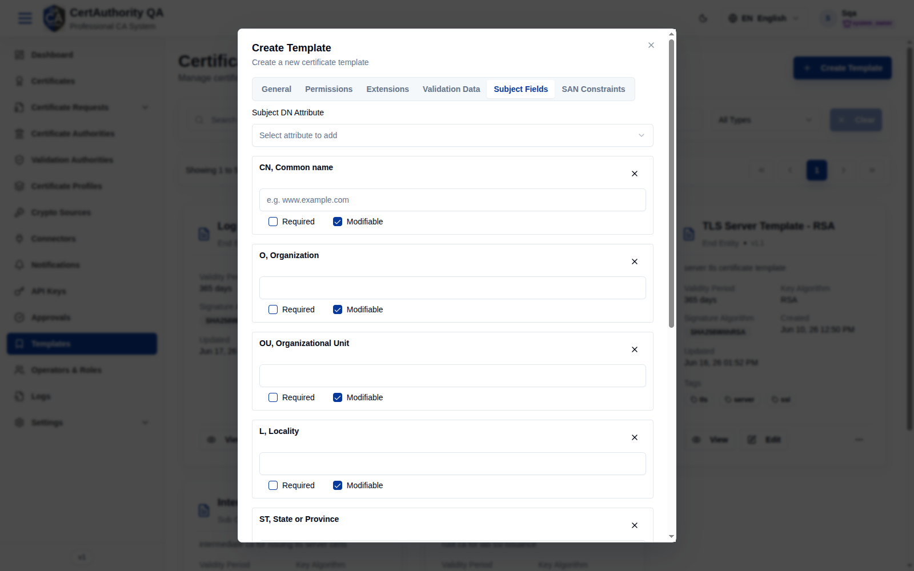
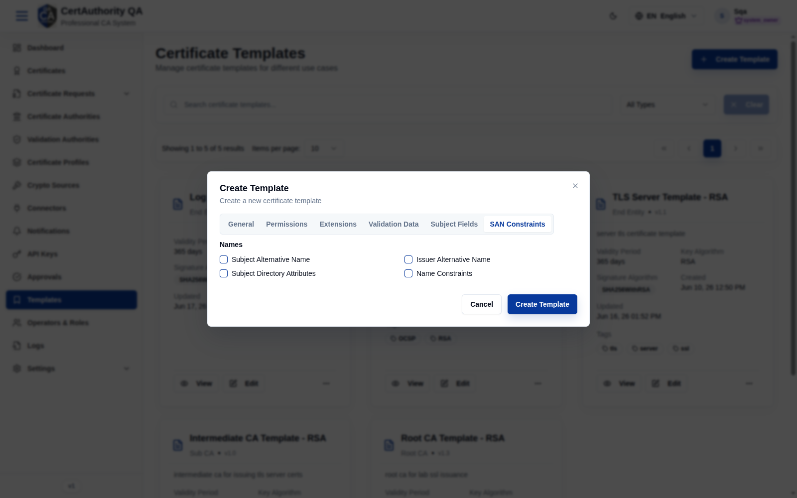

# Templates

## Purpose

Certificate Templates define the reusable blueprint for certificates — type, validity, key and
signature algorithms, extensions, subject-field and SAN constraints. Profiles reference a single
template, and CAs are created from CA templates.

## Navigation

`Templates` (`/templates`)

## Overview

- **Create Template** button.
- **Search**, **Template Type** filter (All Types), **Clear**.
- **Card grid** — each template shows name, **type** (Root CA / Sub CA / End Entity), version,
  **Validity Period**, **Key Algorithm**, **Signature Algorithm**, created/updated, tags, plus
  **View** and **Edit**.

## Fields — Create Template dialog

The dialog has six tabs.

### General

| Field | Description | Required | Notes |
| ----- | ----------- | -------- | ----- |
| Template Name | Display name | Yes | — |
| Template Type | Root CA / Sub CA / End Entity | Yes | Drives path length and usage |
| Path Length | CA path length constraint | Yes | e.g. "0 (No Sub-CAs)" |
| Validity Value / Unit | Default validity | Yes | e.g. 365 Days |
| Key Algorithms | Allowed key algorithms | Yes | Multi-select |
| Signature Algorithm | Signing algorithm | Yes | e.g. SHA256WithRSA |
| Tags | Labels | No | — |
| Description | Purpose | No | — |

### Other tabs

| Tab | Purpose |
| --- | ------- |
| **Permissions** | Who/what may use the template |
| **Extensions** | X.509 extensions (key usage, EKU, etc.) |
| **Validation Data** | Validation rules applied at issuance |
| **Subject Fields** | Allowed/required/modifiable DN fields |
| **SAN Constraints** | Allowed/required SAN types |

**Permissions**

**Extensions**

**Validation Data**

**Subject Fields**

**SAN Constraints**

## Actions

- **Create Template** — add a template (complete all relevant tabs).
- **View / Edit** — inspect or modify a template.

## Step-by-Step — Create a template

1. Open **Templates**.
2. Click **Create Template**.
3. On **General**, set name, type, path length, validity, algorithms.
4. Configure **Extensions**, **Subject Fields**, and **SAN Constraints** as needed.
5. Click **Create Template**.

## Expected Result

The template appears as a card and becomes selectable in [Certificate Profiles](certificate_profiles.md)
and (for CA types) in [Create CA](certificate_authorities.md).

## Notes

- Subject Fields and SAN Constraints here drive what requesters can enter in the
  [request wizard](certificate_request_create.md).
- Template type must match intended use: Root CA / Sub CA for CAs, End Entity for leaf certs.
