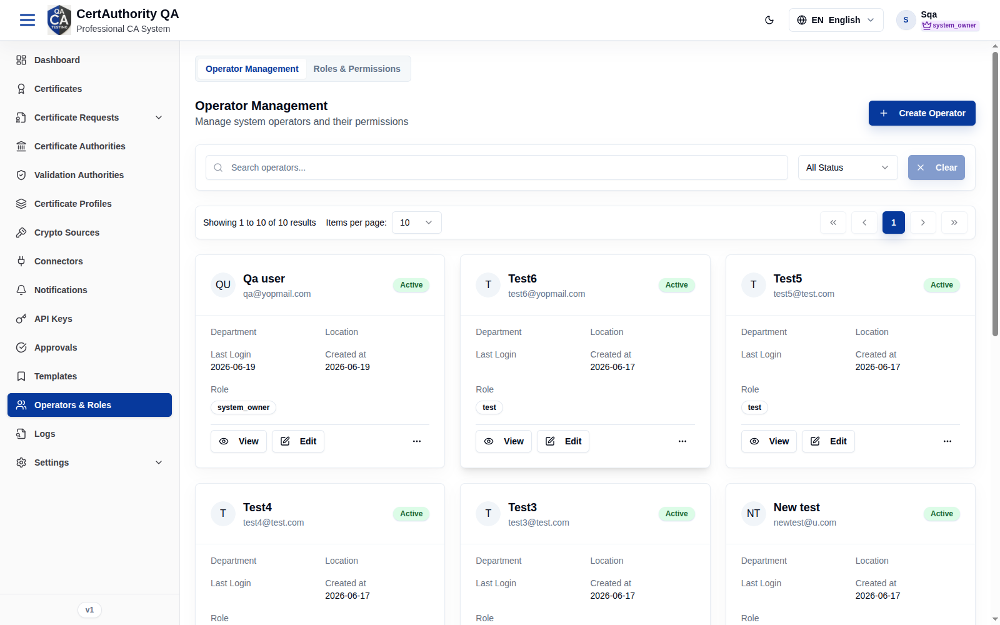
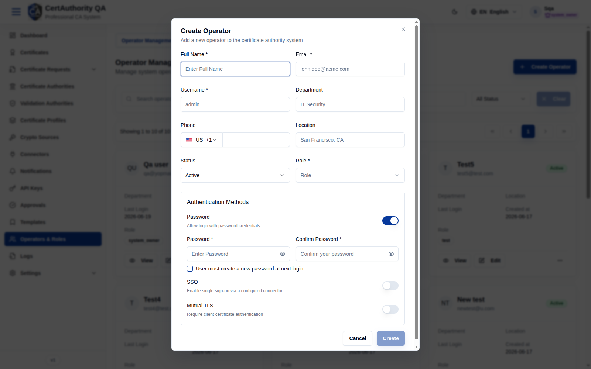
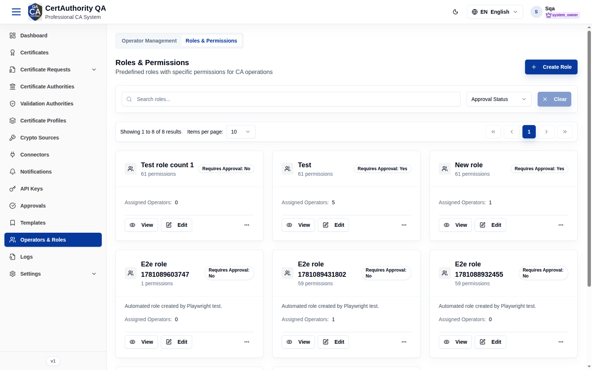
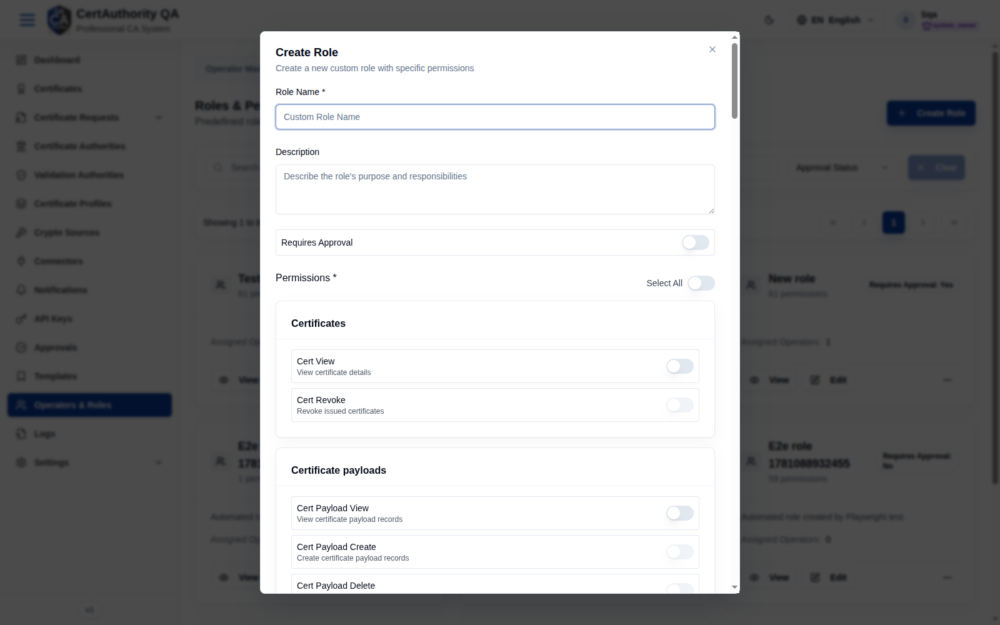

# Operators & Roles

## Purpose

Manage the tenant's **operators** (user accounts) and the **roles** that grant them permissions.
This is the tenant's RBAC control center, including authentication methods and approval-gated
roles.

## Navigation

`Operators & Roles` (`/operators`) — two tabs: **Operator Management** and
**Roles & Permissions**.

## Operator Management

- **Create Operator** button, search, status filter.
- **Operator cards/list** — name, email, status, department, location, last login, created,
  assigned **role**, plus **View** / **Edit** / delete.

### Fields — Create Operator dialog

| Field | Description | Required | Notes |
| ----- | ----------- | -------- | ----- |
| Full Name | Operator's name | Yes | — |
| Email | Email address | Yes | — |
| Username | Login username | Yes | — |
| Department | Org unit | No | — |
| Phone | Country code + number | No | — |
| Location | Free text | No | — |
| Status | Active / Inactive | No | Defaults to Active |
| Role | Assigned role | Yes | From Roles tab |
| **Authentication Methods** | | | |
| Password (toggle) | Allow password login | — | When on: Password + Confirm Password required |
| User must create a new password at next login | Force reset | No | Checkbox |
| SSO (toggle) | Single sign-on via configured connector | No | — |
| Mutual TLS (toggle) | Require client-certificate authentication | No | — |

## Roles & Permissions

- **Create Role** button, search, approval-status filter.
- **Role cards** — name, **N permissions**, **Requires Approval: Yes/No**, **Assigned
  Operators**, plus **View** / **Edit** / delete.

### Fields — Create Role dialog

| Field | Description | Required | Notes |
| ----- | ----------- | -------- | ----- |
| Role name | Display name | Yes | — |
| Description | Purpose | No | — |
| Requires Approval | Make this role's protected writes route to [Approvals](approvals.md) | No | Toggle |
| Permissions | Per-permission switches grouped by resource | Yes | Same catalog as [API Keys](key_management.md#permission-catalog-assignable-scopes) |

Predefined: **system_owner** (full-privilege role seeded per tenant).

## Actions

- **Create Operator / Create Role** — add accounts/roles.
- **View / Edit / Delete** — manage existing operators and roles.
- Assign a **Role** to an operator at create/edit time.

## Step-by-Step — Create an operator

1. Open **Operators & Roles → Operator Management**.
2. Click **Create Operator**.
3. Fill Full Name, Email, Username; choose **Role** and **Status**.
4. Configure **Authentication Methods** (Password and/or SSO / Mutual TLS).
5. Click **Create**.

## Step-by-Step — Create a role

1. Open **Roles & Permissions**.
2. Click **Create Role**.
3. Enter name/description, set **Requires Approval** if dual-control is needed.
4. Toggle the required **Permissions**.
5. Save.

## Expected Result

New operators can sign in with their configured methods; new roles become assignable to
operators and (if marked) enforce approval on protected actions.

## Notes

- **SSO** and **Mutual TLS** are per-operator authentication options enabled here.
- A role with **Requires Approval** turns its holders' protected writes into pending approvals.
- The last active admin cannot be removed/deactivated (lockout guard).
