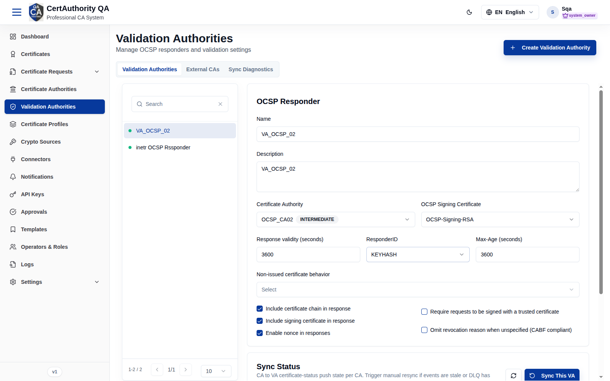
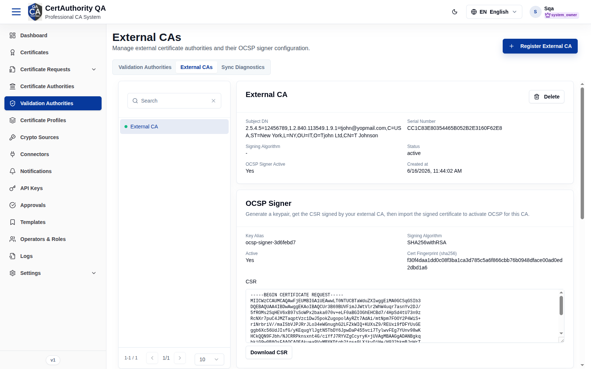
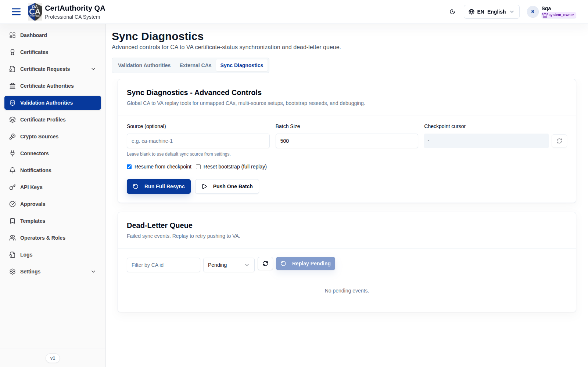
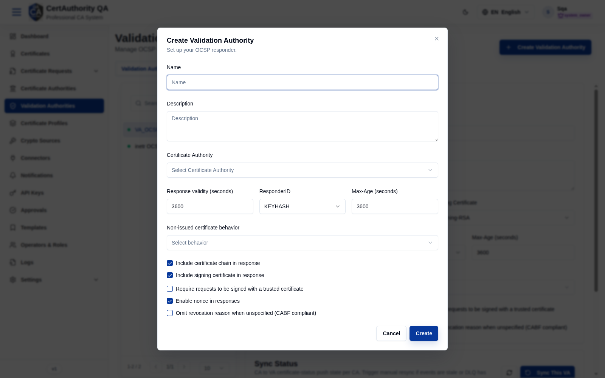

# Validation Authorities

## Purpose

Configure OCSP responders (Validation Authorities), manage external CAs whose status is served
by this VA, and operate the CA→VA certificate-status synchronization.

## Navigation

`Validation Authorities` (`/validation-authorities`)

## Overview

Three tabs plus a **Create Validation Authority** button:

| Tab | Contents |
| --- | -------- |
| **Validation Authorities** | VA list + configuration form + per-CA Sync Status |
| **External CAs** | External CAs whose revocation status this VA serves |
| **Sync Diagnostics** | Advanced CA→VA replay tools and Dead-Letter Queue |

### VA configuration form (Validation Authorities tab)

| Field | Description |
| ----- | ----------- |
| Name / Description | Responder identity |
| Certificate Authority | CA whose status this VA answers for |
| OCSP Signing Certificate | Certificate used to sign OCSP responses |
| Response validity (seconds) | Freshness window |
| ResponderID | KEYHASH / NAME |
| Max-Age (seconds) | HTTP cache hint |
| Non-issued certificate behavior | Response for unknown serials |
| Include certificate chain / signing certificate / nonce | Response options (toggles) |
| Require signed requests | Demand signed OCSP requests |
| Omit revocation reason when unspecified (CABF compliant) | Compliance toggle |

**Sync Status** table (per CA): Last Push, DLQ Pending, Cursor, with **Sync This VA**.

### Sync Diagnostics tab

Advanced controls: **Source**, **Batch Size**, **Checkpoint cursor**, **Resume from
checkpoint**, **Reset bootstrap (full replay)**, **Run Full Resync**, **Push One Batch**; plus
a **Dead-Letter Queue** with filter and **Replay Pending**.

**External CAs**

**Sync Diagnostics**

**Create Validation Authority dialog**

## Actions

- **Create Validation Authority** — add a responder.
- **Save / Reset** — persist or discard VA edits.
- **Sync This VA** — trigger a status push for the selected VA.
- **Run Full Resync / Push One Batch** — bulk re-sync (Sync Diagnostics).
- **Replay Pending** — retry failed DLQ events.

## Step-by-Step — Create a VA

1. Open **Validation Authorities**.
2. Click **Create Validation Authority** and complete the dialog.
3. Select the new VA, set the **Certificate Authority**, **OCSP Signing Certificate**, validity,
   and response options.
4. Click **Save**.

## Expected Result

The VA serves OCSP responses for its CA; the Sync Status table tracks push state.

## Notes

- A VA depends on a response CA and an OCSP signing certificate.
- Use **Sync Diagnostics** when events are stale or the DLQ has pending items.
- Requires the **VA** license module.
